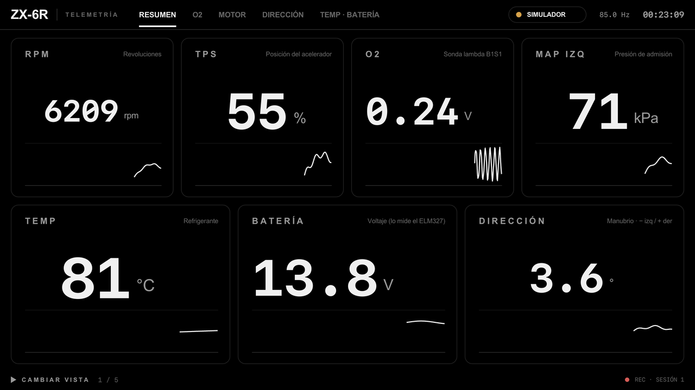
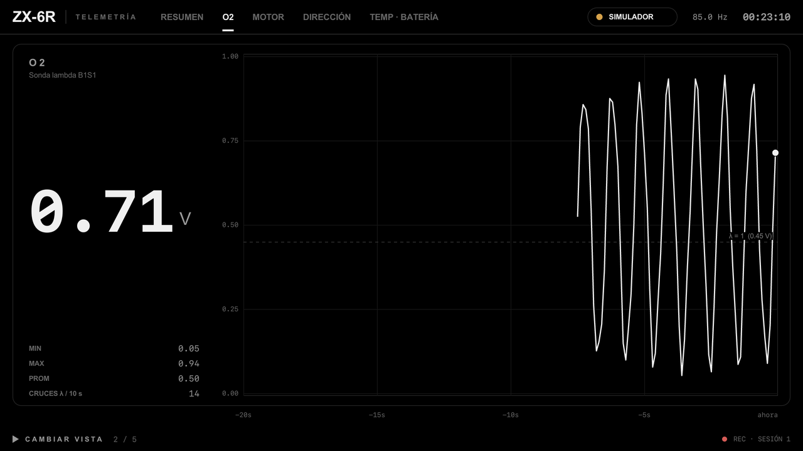
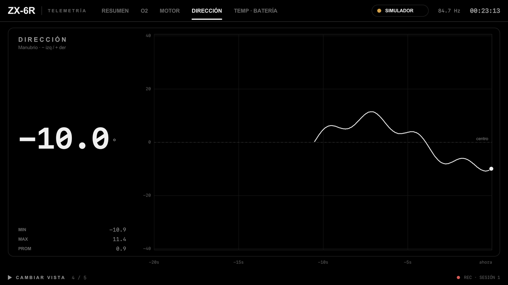
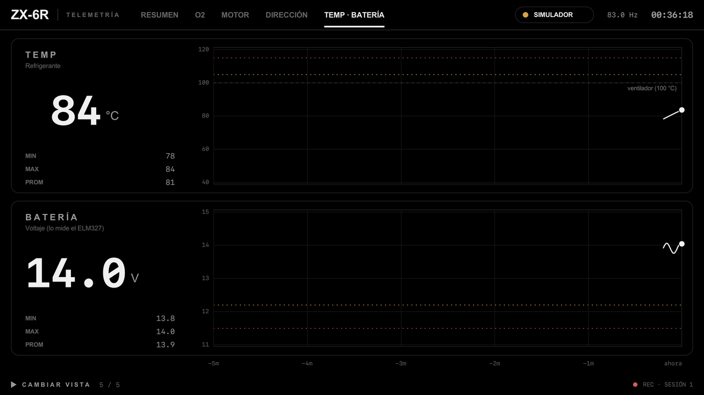
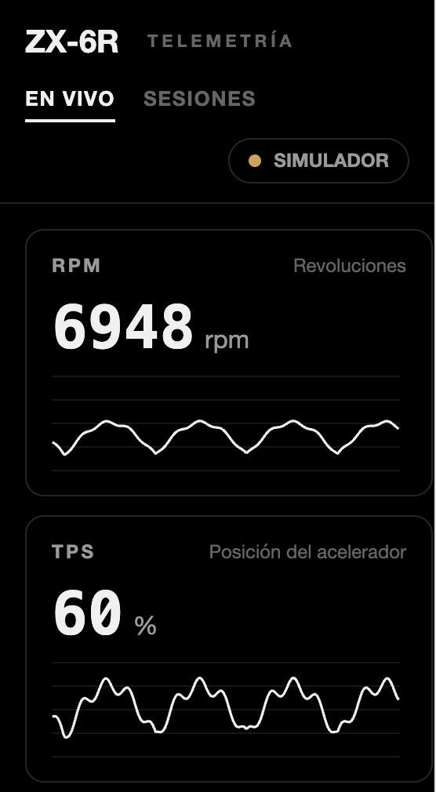
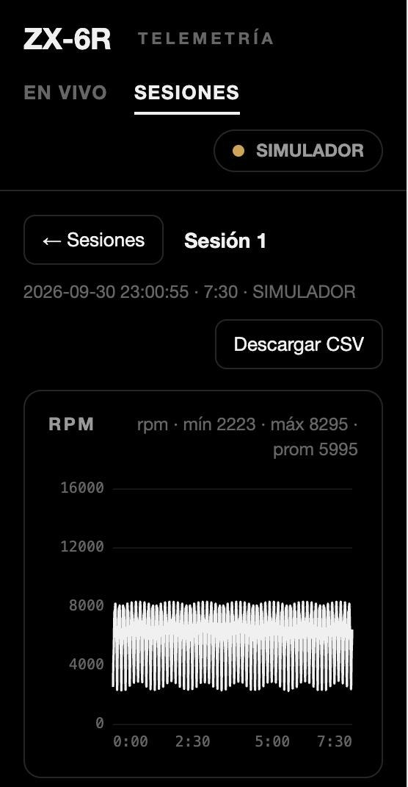
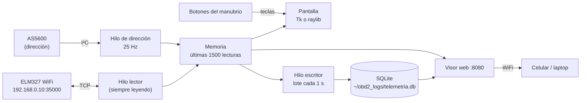

# ZX-6R · Telemetría OBD2

Tablero de telemetría para la Kawasaki ZX-6R 636 (2013+). Lee los sensores de la moto por un adaptador **ELM327 WiFi** y el ángulo del manubrio con un encoder **AS5600**. Lo muestra todo en una pantalla completa que se maneja con dos botones del manubrio, guarda cada lectura en una base de datos local y la sirve a un visor web para verla en el celular, en vivo o después.

Hay dos versiones con el mismo diseño, la misma base de datos y el mismo visor web:

| | [`python/`](python/) | [`cpp/`](cpp/) |
|---|---|---|
| Pantalla | Tkinter (canvas) | raylib (OpenGL) |
| Dependencias | solo biblioteca estándar + Tk | CMake, SQLite y raylib (CMake la descarga) |
| CPU en simulador¹ | 18.6 % de un núcleo, a 12 cuadros/s | 8.7 % de un núcleo, a 30 cuadros/s |
| Memoria¹ | 144 MB | 108 MB |

<sub>¹ Medido en una Mac con Apple Silicon, ventana de 1280×720, vista RESUMEN, con el simulador. En la Raspberry Pi no se ha medido.</sub>

> **Estado:** las dos versiones están probadas con el simulador y con un ELM327 falso en la red local (lectura, reconexión, base de datos, visor web y calibración de la dirección). **No se han probado en la moto.** Según el manual de servicio, la ECU se diagnostica con el sistema propio de Kawasaki (KDS) y es probable que no conteste los PIDs OBD2 estándar que usa la app. Antes de comprar nada, haz la prueba de 5 minutos de la [hoja de conexión](docs/conexion.html).

<p align="center"></p>
<p align="center">
  
  
  
</p>
<p align="center">
  
  
</p>
<p align="center"><sub>Tablero de la versión C++ y visor web en el celular. Todo con datos del simulador.</sub></p>

## Qué hace

- **Siempre leyendo.** Empieza a leer en cuanto se abre. Si se pierde el ELM327, reintenta cada 2 s indefinidamente. Un valor que lleva más de 3 s sin actualizarse se pone gris, para que nunca confundas un dato viejo con uno vivo.
- **Un botón cambia de vista.** ▶ siguiente, ◀ anterior. Vistas:
  - **RESUMEN**: todos los valores;
  - **O2**: la sonda a alta frecuencia, con los cruces rico/pobre;
  - **MOTOR**: RPM, TPS y MAP;
  - **DIRECCIÓN**;
  - **TEMP · BATERÍA**.
- **La O2 se lee en cada vuelta.** Los demás sensores se leen según su periodo: la temperatura cada 2 s y la batería cada 5 s. Con OBD2 estándar y un ELM327 que responde en ~30 ms (medido con uno falso), la O2 llega a ~8 lecturas/s. Si la moto solo habla KDS, el total baja a ~7 lecturas/s repartidas entre todos los sensores (dato de la investigación, no medido).
- **Dirección a 25 lecturas/s.** Va en su propio hilo; no depende del ELM327.
- **Guarda todo en SQLite.** Cada vez que se abre crea una sesión y guarda en lotes cada segundo.
- **Visor web.** Abre `http://<ip-de-la-pi>:8080` desde el celular o la laptop. Tiene valores en vivo, lista de sesiones, gráficas, descarga en CSV y los botones para calibrar la dirección. No usa internet.
- **Simulador.** Con `OBD2_SIM=1` todo funciona sin moto. Las sesiones simuladas quedan marcadas como `SIM`.



## Conexión en la moto

La hoja completa, pin por pin, está en **[`docs/conexion.html`](docs/conexion.html)**. Ábrela en el navegador desde la carpeta del repo, porque GitHub no muestra el HTML. Incluye el esquemático, la prueba del protocolo y la lista de compras con marca y modelo. Lo esencial, sacado del manual de servicio (ZX636ED/FD):

- **El conector de diagnóstico no es el OBD2 de 16 pines.** Es el conector KDS de 4 cables bajo el asiento trasero, junto al sensor de caída. Necesitas un cable adaptador "Kawasaki 4 pines → OBD2 16 pines".
- **Ese conector da 12 V solo con la llave puesta.** El cable BR/W sale del relevador principal de la ECU (manual 3-42), así que el ELM327 se apaga con la moto y no descarga la batería. No alimentes la Pi de ahí.
- **El protocolo probablemente es KDS:** KWP2000 por línea K, con la ECU en la dirección 0x11 y el servicio `21 xx`, no el modo `01` de OBD2. Si la prueba de la hoja confirma que no contesta el modo 01, hay que agregar el modo KDS a la app.
- **El WiFi del ELM327 acepta una sola app a la vez.** Esa conexión la usa la Pi.

## Sensores

| Sensor | Fuente | Rango en pantalla | Se lee | Notas |
|---|---|---|---|---|
| RPM | PID `010C` | 0–16000 rpm | cada 0.25 s | |
| TPS (acelerador) | PID `0111` | 0–100 % | cada 0.25 s | |
| Temperatura refrigerante | PID `0105` | 40–120 °C | cada 2 s | ámbar ≥ 105 °C, rojo ≥ 115 °C; línea en 100 °C, donde se prende el ventilador (manual, cap. 4) |
| O2 B1S1 | PID `0114` | 0–1 V | en cada vuelta | solo en las versiones que la traen; línea en 0.45 V (λ = 1) |
| MAP (presión de admisión) | PID `010B` | 20–120 kPa | cada 0.25 s | línea en 101 kPa (presión atmosférica) |
| Batería | `ATRV` del ELM327 | 11–15 V | cada 5 s | ámbar ≤ 12.2 V, rojo ≤ 11.5 V |
| Dirección | AS5600 por I²C | −40…40 ° | 25 por segundo | negativo = izquierda |
| "MAP derecho" | `2201F0` | 20–120 kPa | cada 0.5 s | **apagado** (`OBD2_MAP_R=1`). Según el manual, el segundo sensor de presión de esta moto mide la presión **atmosférica**, no un lado derecho |

Los umbrales están en la tabla `SENSORS` de cada versión y son configurables.

Si la ECU no responde un PID, ese valor muestra `N/D` y los demás siguen funcionando. Si no responde ninguno, el indicador de arriba dice **SIN DATOS ECU**.

## Sensor de dirección (AS5600)

Usa un encoder magnético: un imán en el eje de la dirección y el sensor fijo al cuadro, a 0.5–3 mm, sin tocarse. No se usó un servo como encoder: sus engranes acoplados a la dirección se pueden trabar, y su juego (~1°) es grande para los pocos grados que se gira a velocidad.

| AS5600 | Raspberry Pi 4 |
|---|---|
| VCC | pin 1 (3.3 V) |
| GND | pin 9 |
| SDA | pin 3 (GPIO2) |
| SCL | pin 5 (GPIO3) |
| DIR | a GND (fija el sentido; no lo dejes al aire) |

- Activa el I²C con `sudo raspi-config` (Interface Options → I2C).
- El cable debe medir menos de 50 cm, así que la Pi va al frente, cerca del tablero.
- **Calibrar:** con la moto derecha, en el visor web toca **Fijar centro**. Si los lados salen al revés, toca **Invertir**. En un teclado conectado a la Pi, la tecla `C` también fija el centro. La calibración se guarda en `~/obd2_logs/direccion.json` y las dos versiones la comparten.
- **Sin el sensor conectado**, la vista DIRECCIÓN dice "SIN SENSOR" y todo lo demás sigue funcionando.

## Cómo correrlo

### Python

Necesita Python 3.9+ con Tk:

```bash
# macOS
brew install python-tk@3.14
# Raspberry Pi OS
sudo apt install python3-tk
```

```bash
cd python
OBD2_SIM=1 OBD2_WINDOWED=1 python3 analizador.py   # simulador en una ventana
python3 analizador.py                              # moto real, pantalla completa
OBD2_HEADLESS=1 python3 analizador.py              # sin pantalla: solo lee, guarda y sirve la web
```

### C++

```bash
# macOS
brew install cmake
# Raspberry Pi OS
sudo apt install build-essential cmake libsqlite3-dev libx11-dev libxrandr-dev libxinerama-dev libxcursor-dev libxi-dev libgl1-mesa-dev
```

```bash
cmake -S cpp -B cpp/build -DCMAKE_BUILD_TYPE=Release
cmake --build cpp/build -j
OBD2_SIM=1 OBD2_WINDOWED=1 ./cpp/build/zx6r   # simulador en una ventana
./cpp/build/zx6r                               # moto real, pantalla completa
```

La primera vez CMake descarga raylib 5.5 (42 MB) y la compila; en la Mac tardó ~2 minutos. Después, compilar tarda unos segundos.

### Teclas

| Acción | Teclas |
|---|---|
| Siguiente vista | → · Espacio · Enter · Av Pág · ↓ · N |
| Vista anterior | ← · Retroceso · Re Pág · ↑ · P |
| Fijar el centro de la dirección | C |
| Salir | Esc |

## Botones del manubrio

Las dos versiones escuchan **teclas**, así que sirve cualquier botón que mande una tecla:

1. **Control Bluetooth o USB para manubrio.** Casi todos mandan flechas, Enter o teclas de volumen. Si el tuyo manda otra tecla, agrégala a `NEXT_KEYS` / `PREV_KEYS`.
2. **Botones a GPIO en la Raspberry Pi con el overlay `gpio-key`.** El kernel los convierte en teclas; no hace falta código. Conecta cada botón entre el GPIO y GND. Agrega esto a `/boot/firmware/config.txt` (`/boot/config.txt` antes de Bookworm), con los comentarios en su propia línea, y reinicia:
   ```ini
   # botón ▶ siguiente (GPIO17, pin 11)
   dtoverlay=gpio-key,gpio=17,active_low=1,gpio_pull=up,keycode=106
   # botón ◀ anterior (GPIO27, pin 13)
   dtoverlay=gpio-key,gpio=27,active_low=1,gpio_pull=up,keycode=105
   ```
3. **Solo Python: `gpiozero`.** `pip install gpiozero` y `BTN_NEXT_GPIO=17 BTN_PREV_GPIO=27 python3 analizador.py`.

Los botones se probaron con teclas y con un `gpiozero` simulado. Falta probarlos en una Pi con botones físicos.

## Ver los datos después

**En el celular.** Conéctalo a la misma red que la Pi y abre la dirección que aparece abajo a la derecha del tablero (`WEB 192.168.0.11:8080`). La pestaña **SESIONES** muestra cada sesión con sus gráficas y el botón **Descargar CSV**. Que el celular se conecte por el WiFi del ELM327 no está probado; la hoja de conexión explica cómo comprobarlo.

**En la base de datos.** El archivo es `~/obd2_logs/telemetria.db`, el mismo para las dos versiones:

```sql
-- sessions(id, started, sim)         una fila por cada vez que se abrió la app
-- samples(session, t, sensor, value) una fila por lectura; t = segundos desde el inicio
SELECT sensor, MIN(value), MAX(value), AVG(value) FROM samples WHERE session = 3 GROUP BY sensor;
```

```bash
sqlite3 -header -csv ~/obd2_logs/telemetria.db "SELECT t, value FROM samples WHERE session = 3 AND sensor = 'steer'" > direccion.csv
```

**API**, por si quieres conectarla a otra cosa:
- `GET /api/live?trace=30`
- `GET /api/sessions`
- `GET /api/session/<id>` y `/api/session/<id>.csv`
- `POST /api/steer/center` y `POST /api/steer/invert`

## Configuración

Todo se configura con variables de entorno, con los mismos nombres en las dos versiones.

| Variable | Default | Qué hace |
|---|---|---|
| `OBD2_SIM` | `0` | `1` = datos simulados |
| `OBD2_IP` / `OBD2_PORT` | `192.168.0.10` / `35000` | dirección del ELM327 |
| `OBD2_WINDOWED` | `0` | `1` = ventana de 1280×720 en vez de pantalla completa |
| `OBD2_HEADLESS` | `0` | `1` = sin pantalla: solo lee, guarda y sirve la web |
| `OBD2_FPS` | `12` Python · `30` C++ | cuadros por segundo de la pantalla |
| `OBD2_DB` | `~/obd2_logs/telemetria.db` | archivo SQLite |
| `OBD2_WEB_PORT` | `8080` | puerto del visor web (`0` lo apaga) |
| `OBD2_STEER` | `1` | `0` = sin sensor de dirección |
| `OBD2_I2C_BUS` | `1` | bus I²C del AS5600 (`/dev/i2c-1`) |
| `OBD2_STEER_CAL` | junto a la base | archivo de calibración de la dirección |
| `OBD2_MAP_R` | `0` | `1` = también lee el PID `2201F0` |
| `BTN_NEXT_GPIO` / `BTN_PREV_GPIO` | — | solo Python: pines de los botones (con `gpiozero`) |
| `OBD2_FONT_SANS` / `OBD2_FONT_MONO` | automático | Python: familia de letra |
| `OBD2_FONT_SANS_FILE` / `OBD2_FONT_MONO_FILE` | automático | C++: archivo TTF |
| `OBD2_SNAPSHOT_DIR` | — | solo C++, para pruebas: guarda un PNG por vista y sale |

## ¿Python o C++?

Las dos leen igual de rápido: el límite es el ELM327 (o el protocolo KDS), no el lenguaje. Python tarda ~1–2 ms en dibujar un cuadro; la consulta a la moto, decenas de milisegundos.

La diferencia está en dibujar. Python usa el canvas de Tk, que dibuja con el CPU. C++ usa la tarjeta gráfica (OpenGL), y por eso hace 2.5× más cuadros por segundo con la mitad del CPU (tabla de arriba).

- **En la moto conviene C++:** la Raspberry Pi tiene mucho menos CPU que una Mac.
- **Python** sirve para probar cambios rápido, sin compilar.

Las dos escriben la misma base y sirven el mismo visor, así que puedes cambiar de una a otra sin perder datos.

## Estructura

```
python/analizador.py   versión Python (un solo archivo)
cpp/                   versión C++ (CMake)
web/index.html         visor web; lo sirven las dos versiones
docs/conexion.html     hoja de conexión y lista de compras
docs/*.png, *.jpg      capturas para este README
```

## Pendientes e ideas

- Probar en la moto: la prueba de protocolo de la hoja de conexión.
- Si la ECU solo habla KDS, agregar el modo KDS (KWP2000, servicio `21 xx`) a las dos versiones.
- Confirmar cuál de los dos cables de comunicación del conector KDS es la línea K.
- Reemplazar "MAP derecho" por la presión atmosférica cuando se sepa el protocolo.
- Leer y borrar códigos de falla.
- Sincronizar las sesiones a la nube cuando la Pi esté en el WiFi de la casa.
- Arranque automático en la Pi con systemd.
