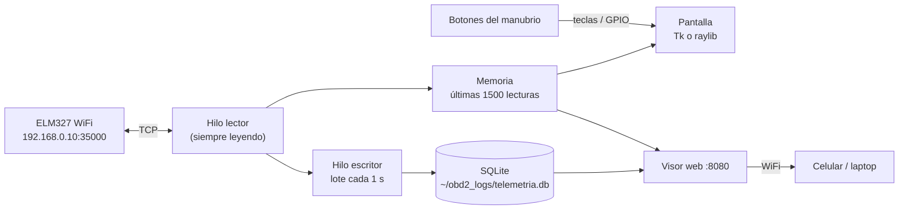

# ZX-6R · Telemetría OBD2

Tablero de telemetría para la Kawasaki ZX-6R. Lee los sensores por un adaptador **ELM327 WiFi**, los muestra en pantalla completa y guarda cada lectura en una base de datos local. Desde el celular puedes verlos en vivo o revisar sesiones pasadas.

Hay dos versiones con el mismo diseño, la misma base de datos y el mismo visor web:

| | [`python/`](python/) | [`cpp/`](cpp/) |
|---|---|---|
| Pantalla | Tkinter (canvas) | raylib (OpenGL) |
| Dependencias | solo biblioteca estándar + Tk | CMake, raylib (se descarga sola), SQLite |
| Estado | lista, probada con simulador y ELM327 falso | **en construcción** |

> **Estado:** probado con el simulador y con un ELM327 falso en la red local. **Todavía no se ha probado en la moto.** Los PIDs estándar que use la ECU de la ZX-6R hay que confirmarlos conectado.

<p align="center">
  
  
</p>
<p align="center"><sub>Visor web desde el celular (datos del simulador): en vivo y una sesión guardada.</sub></p>

## Qué hace

- **Siempre leyendo.** Arranca leyendo en cuanto se abre. Si el ELM327 se desconecta, reintenta cada 2 s para siempre. Los valores se ponen en gris si llevan más de 3 s sin actualizarse, para que nunca confundas un dato viejo con uno vivo.
- **Un botón cambia de vista.** Está pensado para los botones del manubrio: ▶ siguiente, ◀ anterior. Vistas: **RESUMEN** (todos los valores), **O2** (la sonda a alta frecuencia), **MOTOR** (RPM, TPS y MAP) y **TEMP · BATERÍA**.
- **La O2 se lee en cada vuelta.** Los demás sensores se leen según su periodo; la temperatura cada 2 s y la batería cada 5 s. Con un ELM327 que responde en ~30 ms (medido con uno falso en la red local) la O2 llega a ~8 lecturas/s, suficiente para ver la oscilación rico/pobre. Con un adaptador más lento baja en proporción.
- **Guarda todo en SQLite.** Cada vez que se abre crea una sesión nueva y guarda en lotes cada segundo.
- **Visor web.** En `http://<ip-de-la-pi>:8080` desde el celular o la laptop: valores en vivo, lista de sesiones, gráficas de cada una y descarga en CSV. No necesita internet, porque el celular conectado al WiFi del ELM327 no tiene.
- **Simulador.** Con `OBD2_SIM=1` todo funciona sin moto. Las sesiones simuladas quedan marcadas como `SIM` en la base de datos.



## Sensores

| Sensor | PID | Rango en pantalla | Se lee | Notas |
|---|---|---|---|---|
| RPM | `010C` | 0–16000 rpm | cada 0.25 s | |
| TPS (acelerador) | `0111` | 0–100 % | cada 0.25 s | |
| Temperatura refrigerante | `0105` | 40–130 °C | cada 2 s | ámbar ≥ 105 °C, rojo ≥ 115 °C |
| O2 B1S1 | `0114` | 0–1 V | en cada vuelta | línea de referencia en 0.45 V (λ = 1); cuenta los cruces rico/pobre |
| MAP izquierdo | `010B` | 15–110 kPa | cada 0.25 s | línea de referencia en 101 kPa (presión atmosférica) |
| Batería | `ATRV` | 10–15 V | cada 5 s | la mide el propio ELM327; ámbar ≤ 12.2 V, rojo ≤ 11.5 V |
| MAP derecho | `2201F0` | 15–110 kPa | cada 0.5 s | **apagado por defecto** (`OBD2_MAP_R=1`). Es un PID propietario de Kawasaki y la escala /10 no está confirmada |

Los umbrales de color están en la tabla `SENSORS` de cada versión. Son un punto de partida: verifícalos con el manual de servicio.

Si la ECU no responde un PID, ese valor muestra `N/D` y los demás siguen funcionando. Si ninguno responde, el indicador de arriba dice **SIN DATOS ECU**.

## Cómo correrlo

### Python

Necesita Python 3.9+ con Tk.

```bash
# macOS
brew install python-tk@3.14
# Raspberry Pi OS
sudo apt install python3-tk
```

```bash
cd python
OBD2_SIM=1 OBD2_WINDOWED=1 python3 analizador.py   # simulador en una ventana
python3 analizador.py                              # moto real, pantalla completa
OBD2_HEADLESS=1 python3 analizador.py              # sin pantalla: solo lee, guarda y sirve la web
```

### C++

> En construcción: estos pasos todavía no están verificados.

```bash
# macOS
brew install cmake
# Raspberry Pi OS
sudo apt install build-essential cmake git libsqlite3-dev libx11-dev libxrandr-dev libxinerama-dev libxcursor-dev libxi-dev libgl1-mesa-dev
```

```bash
cmake -S cpp -B cpp/build -DCMAKE_BUILD_TYPE=Release
cmake --build cpp/build -j
OBD2_SIM=1 OBD2_WINDOWED=1 ./cpp/build/zx6r   # simulador en una ventana
./cpp/build/zx6r                               # moto real, pantalla completa
```

La primera vez CMake descarga y compila raylib 5.5, así que tarda un par de minutos.

### Teclas

| Acción | Teclas |
|---|---|
| Siguiente vista | → · Espacio · Enter · Av Pág · ↓ · N |
| Vista anterior | ← · Retroceso · Re Pág · ↑ · P |
| Salir | Esc |

## Botones del manubrio

Las dos versiones solo escuchan **teclas**, así que cualquier botón que mande una tecla sirve. Tienes tres opciones:

1. **Control Bluetooth o USB para manubrio.** Casi todos mandan flechas, Enter o teclas de volumen. Si el tuyo manda otra tecla, agrégala a `NEXT_KEYS` / `PREV_KEYS`.
2. **Botones a GPIO en la Raspberry Pi con el overlay `gpio-key`.** El kernel los convierte en teclas, sin código extra, y sirve para las dos versiones. Conecta cada botón entre el GPIO y GND y agrega a `/boot/firmware/config.txt` (`/boot/config.txt` en versiones anteriores a Bookworm), luego reinicia:
   ```ini
   dtoverlay=gpio-key,gpio=17,active_low=1,gpio_pull=up,keycode=106   # → siguiente
   dtoverlay=gpio-key,gpio=27,active_low=1,gpio_pull=up,keycode=105   # ← anterior
   ```
3. **Solo Python: `gpiozero`.** `pip install gpiozero` y `BTN_NEXT_GPIO=17 BTN_PREV_GPIO=27 python3 analizador.py`.

La lógica de botones se probó con teclas y con un `gpiozero` simulado. Falta probarla en una Pi con botones físicos.

## Ver los datos después

**En el celular.** Conéctalo a la misma red que la Pi, ya sea el WiFi del ELM327 o el de tu casa, y abre la dirección que aparece abajo a la derecha del tablero (`WEB 192.168.0.11:8080`). La pestaña **SESIONES** tiene cada sesión con sus gráficas y el botón **Descargar CSV**.

**En la base de datos.** El archivo está en `~/obd2_logs/telemetria.db` y es el mismo para las dos versiones:

```sql
-- sessions(id, started, sim)        una fila por cada vez que se abrió la app
-- samples(session, t, sensor, value) una fila por lectura; t = segundos desde el inicio
SELECT sensor, MIN(value), MAX(value), AVG(value) FROM samples WHERE session = 3 GROUP BY sensor;
```

```bash
sqlite3 -header -csv ~/obd2_logs/telemetria.db "SELECT t, value FROM samples WHERE session = 3 AND sensor = 'o2'" > o2.csv
```

**API JSON**, por si quieres conectarla a otra cosa: `GET /api/live?trace=30` · `/api/sessions` · `/api/session/<id>` · `/api/session/<id>.csv`.

## Configuración

Todo se configura con variables de entorno y las dos versiones usan los mismos nombres.

| Variable | Default | Qué hace |
|---|---|---|
| `OBD2_SIM` | `0` | `1` = datos simulados |
| `OBD2_IP` / `OBD2_PORT` | `192.168.0.10` / `35000` | dirección del ELM327 |
| `OBD2_WINDOWED` | `0` | `1` = ventana de 1280×720 en vez de pantalla completa |
| `OBD2_FPS` | `12` Python · `30` C++ | cuadros por segundo de la pantalla |
| `OBD2_DB` | `~/obd2_logs/telemetria.db` | archivo SQLite |
| `OBD2_WEB_PORT` | `8080` | puerto del visor web (`0` lo apaga) |
| `OBD2_MAP_R` | `0` | `1` = también lee el MAP derecho |
| `OBD2_HEADLESS` | `0` | solo Python: sin pantalla, solo lee, guarda y sirve la web |
| `BTN_NEXT_GPIO` / `BTN_PREV_GPIO` | — | solo Python: pines GPIO de los botones (con `gpiozero`) |
| `OBD2_FONT_SANS` / `OBD2_FONT_MONO` | automático | Python: familia de letra |
| `OBD2_FONT_SANS_FILE` / `OBD2_FONT_MONO_FILE` | automático | C++: archivo TTF |
| `OBD2_SNAPSHOT_DIR` | — | solo C++, para pruebas: guarda un PNG por vista y sale |

## ¿Python o C++?

Pendiente: la comparación se mide con las dos versiones corriendo en las mismas condiciones, en cuanto la versión C++ esté lista.

Lo que ya está medido: en simulador, la versión Python usa ~18 % de un núcleo y ~135 MB de memoria (vista RESUMEN, ventana de 1280×720, 12 cuadros/s, Mac con Apple Silicon). La velocidad de lectura la limita el ELM327, que tarda decenas de milisegundos por consulta, no el lenguaje: Python dibuja cada cuadro en ~1–2 ms.

## Estructura

```
python/analizador.py   versión Python (un solo archivo)
cpp/                   versión C++ (CMake)
web/index.html         visor web, lo sirven las dos versiones
docs/                  capturas para este README
```

## Pendientes e ideas

- Probar en la moto y confirmar qué PIDs responde la ECU.
- Leer y borrar códigos de falla (modo `03` / `04`).
- Sincronizar las sesiones a la nube (por ejemplo Supabase) cuando la Pi se conecte al WiFi de la casa. Mientras está conectada al ELM327 no tiene internet.
- Arranque automático en la Pi con un servicio de systemd.
